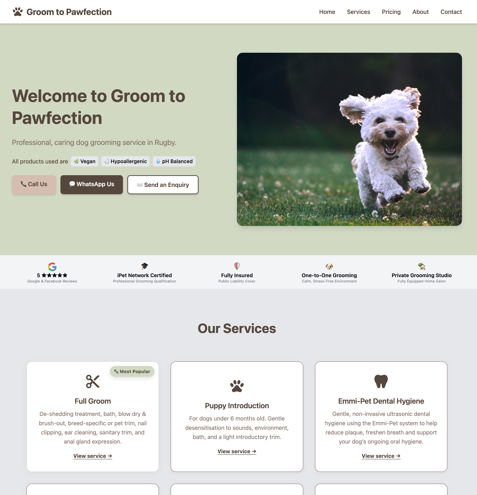
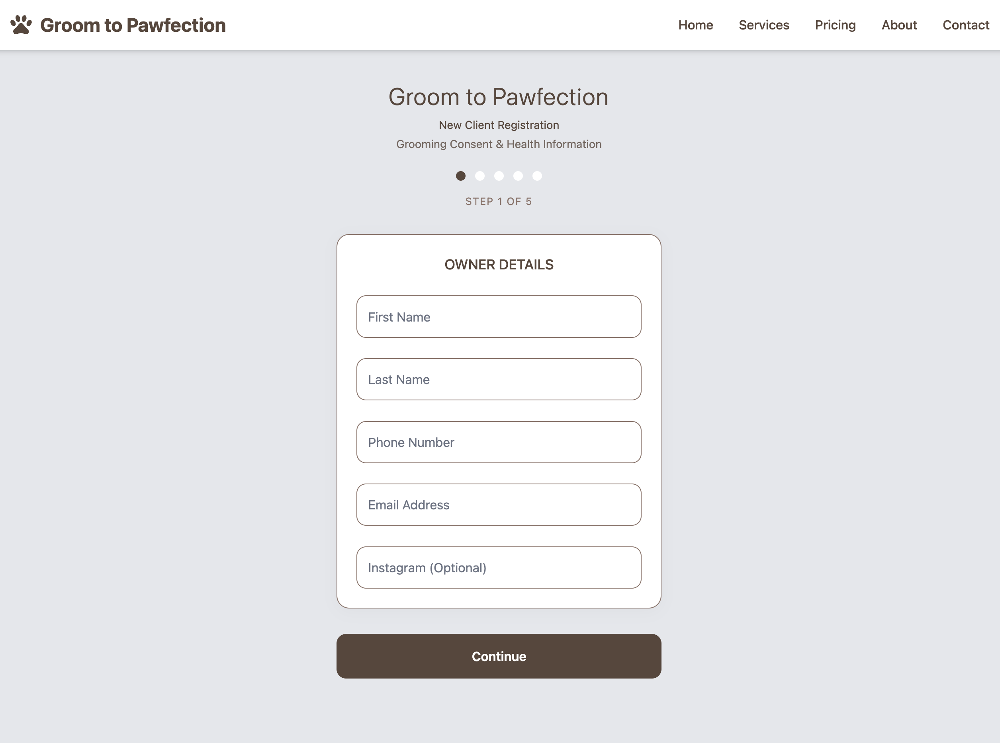
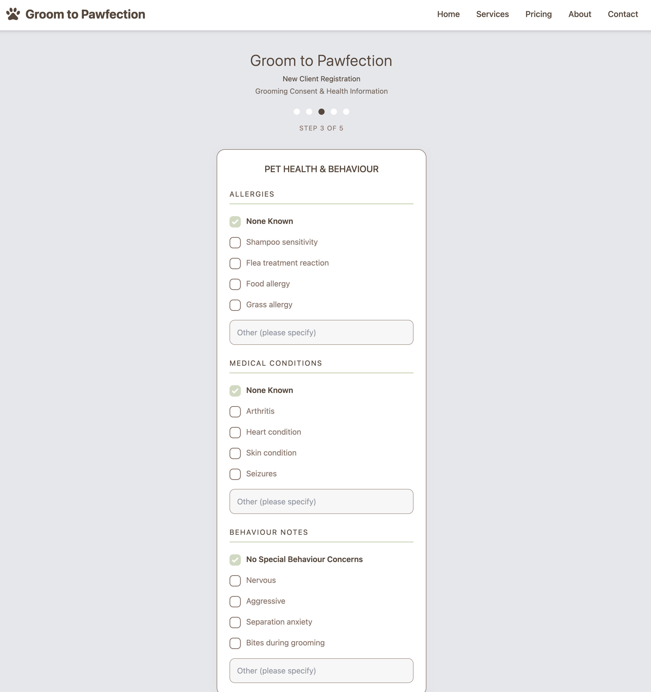
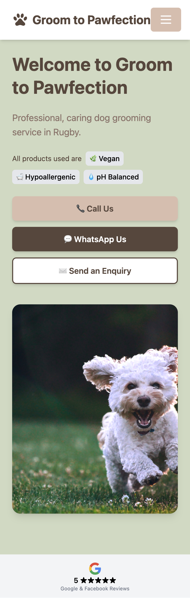

# Groom to Pawfection

### Production Website & Digital Client Onboarding System

A production website developed for **Groom to Pawfection**, an independent dog grooming business based in Rugby, Warwickshire.

The project combines a modern small-business website with a custom digital client-registration and grooming-consent workflow.

## Live Website

**https://groomtopawfection.co.uk**

---

## Project Screenshots

### Desktop Homepage

### New Client Registration

### Health & Behaviour Workflow

### Responsive Mobile Homepage

## The Project

Groom to Pawfection needed a professional online presence that clearly presented the business, its services and its approach to dog grooming.

The website also needed to simplify the onboarding of new customers by replacing a manual registration process with a structured digital workflow.

The result is a responsive multi-page website with an integrated new-client registration and consent system.

## Key Features

- Responsive multi-page business website
- Dedicated service and service-detail pages
- New-client onboarding workflow
- Five-stage digital registration and grooming waiver
- Dog breed selection
- Health, medical and behavioural information capture
- Grooming and media consent management
- Digital signature capture
- Client-side form validation
- Independent server-side validation
- UK phone number and email validation
- Transactional email notifications
- Customer submission confirmation
- SEO metadata
- XML sitemap
- Privacy, cookie, terms and accessibility pages
- Automated end-to-end testing

## Technology

- **Svelte 5**
- **SvelteKit 2**
- **TypeScript**
- **Tailwind CSS 4**
- **Vite**
- **Resend**
- **Playwright**
- **Cloudflare deployment tooling**

## Architecture

Customer-facing business content is separated from application logic through a central configuration structure.

This keeps business information, website copy and contact details maintainable while allowing application routes, validation, forms and server-side functionality to remain independently structured.

The new-client registration system performs validation in both the browser and on the server before processing submissions.

User-provided content included in transactional emails is escaped server-side before being rendered into HTML.

## Client Registration Workflow

The custom registration system collects:

1. Owner details
2. Dog information
3. Health and behavioural information
4. Grooming and media consent
5. Digital signature

Successful submissions are processed server-side and generate transactional email communications for both the business and customer.

## Development & Testing

The project uses TypeScript throughout the application and includes automated end-to-end testing with Playwright.

The production source repository is maintained privately because this is a commercial client project.

---

## Developed By

**Al Hewitt — BuiltByAl**

Software development, web applications and digital business systems.

**Altheia Pine Labs**
